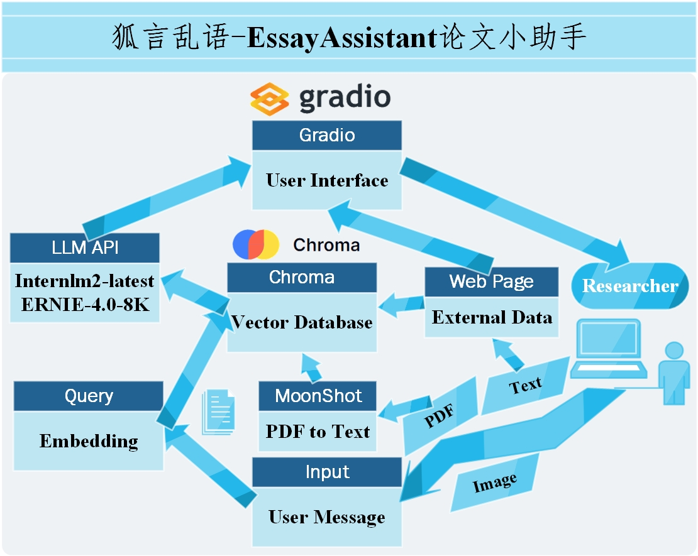

# **狐言乱语-EssayAssistant 论文小助手**

## 项目概述

**狐言乱语-EssayAssistant**致力于解决科研人员在文献检索、内容理解和论文撰写过程中的痛点。通过大模型强大的文本能力，狐言乱语能够快速理解用户的查询需求，并提供精准的文献资料。同时，其文本解析功能可以提炼出论文的核心观点和关键信息，促进用户对论文内容的吸收和理解，并生成相应的文献综述。

## 项目流程

当前版本主要使用了三方API: 百度智能云千帆AppBuilder、ChatGLM、Moonshot。

用户启动软件后，通过gradio生成的UI于浏览器里交互，用户发送的文本数据分情况：狐聊、狐说模块中直接递交给大模型进行通信，狐找模块中会相应搜寻相关的文献资料，递交前端并生成向量数据库，狐写模块中会发送给向量数据库进行查询，将与查询结果一齐打包给大模型通信。相应的，大模型回复会直接显示在前端。



## **应用功能**

***狐言乱语论文小助手：简化学术研究的每一步***

我们的狐言乱语论文小助手是一个创新的解决方案，旨在克服学术论文查找、阅读和应用中的常见挑战。该项目通过四个核心模块——**狐聊**、**狐说**、**狐找**和**狐写**——为用户提供全方位的支持。

- 在**狐聊模块**中，我们利用大型模型的长上下文能力，创造了一个虚拟的疗慰师，它能倾听学生的困扰和压力，并用幽默的语言帮助他们缓解疲劳，让学术之旅更加轻松愉快。

  - 与大模型直接对话、聊天

  - 可以上传图像

- **狐说模块**则是一个高效的学习工具，它通过视觉语言模型（VLM）和先进的文档解读接口，帮助用户快速掌握论文的要点，并深入讨论论文的细节，确保用户对研究内容有全面的理解。

  - 上传pdf格式的学术论文，递交给大模型分析论文大体情况
  - 结合单页论文与论文分析，与大模型针对论文细节展开讨论

- **狐找模块**是一个强大的资源库，它提供了大量相关论文供学生检索和比较。通过与大型模型的互动，学生可以迅速了解相关论文的关键信息，从而明确自己的研究方向和技术的重点。

  - 搜索大量论文数据，组建本地向量数据库
  - 构建RAG，根据用户要求精准筛选论文

- 最后，**狐写模块**利用狐找模块提供的大量数据和用户上传的论文以及借助插件从arXiv获取的相关文献，能够迅速生成高质量的相关领域综述文章。这为学生撰写背景调查、学术论文等提供了坚实的基础框架，加速了学术写作的进程。

  - 根据向量近似搜索，锚定强相关文献撰写综述文章

  - 根据arXiv搜索的文献，撰写相关综述文章

    

## 快速开始

拉取github仓库

```
git clone https://github.com/jabberwockyang/MedicalReviewAgent.git
```

创建conda环境

```
cd .\EssayAssistant\
conda create -n essayassistant python=3.10 -y
```

激活环境并安装依赖包

```
conda activate essayassistant
pip install -r requirements.txt
```

启动软件，在自动跳出的浏览器界面使用即可

```
 python .\ui_verification.py
```

跳出界面如下，则代表已经启动成功。(第一次与大模型对话会稍慢，耐心等待即可)


## 功能界面展示

视频演示：[狐言乱语-EssayAssistant 论文小助手开源项目分享](https://www.bilibili.com/video/BV1f63GeWERX/?spm_id_from=333.999.0.0&vd_source=d436b7d228751a31b7b154d27804911f)

**狐聊界面展示：**


**狐说界面展示：**


**狐找界面展示：**


**狐写界面展示：**


## 感谢

[某位不想看文献的小伙伴](https://github.com/jabberwockyang)

[BCEmbedding](https://github.com/netease-youdao/BCEmbedding/tree/master)

[AppBuilder-SDK](https://github.com/baidubce/app-builder)

## License

狐言乱语-EssayAssistant遵循[Apache-2.0开源协议](LICENSE.txt)。